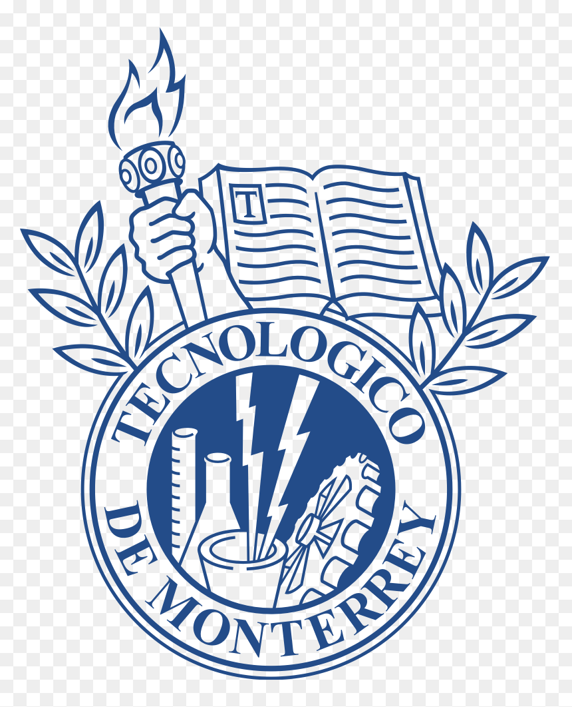

## Tecnológico de Monterrey

  
  

    <h2 style="margin: 0;">Tecnológico de Monterrey</h2>
    

      Monterrey, Mexico · Aug. 2021 – Jul. 2026
    

  

**Double Degree in Economics and Government and Public Transformation**\
*Aug. 2021 – Jul. 2026 · Monterrey, Mexico*

**Highest GPA in Government and Public Transformation**

**Honorable Mention in Economics**

**GPA:** 96 / 100

### Honors & Awards

**Best Undergraduate Research in Economics** · 2025 & 2026\
Tecnológico de Monterrey

**Outstanding Student Leadership Award**\
Omicron Delta Epsilon

**Second Place, Tech Política Essay Contest – 2024**\
FLACSO Ecuador (Department of Political Studies)

**Student Leadership Award - Economics & Government and Public Transformation** · 2025 & 2026\
Tecnológico de Monterrey

### Memberships

**Omicron Delta Epsilon (ODE)**\
The International Honor Society in Economics

**Eugenio Garza Sada Global Leadership Program**
