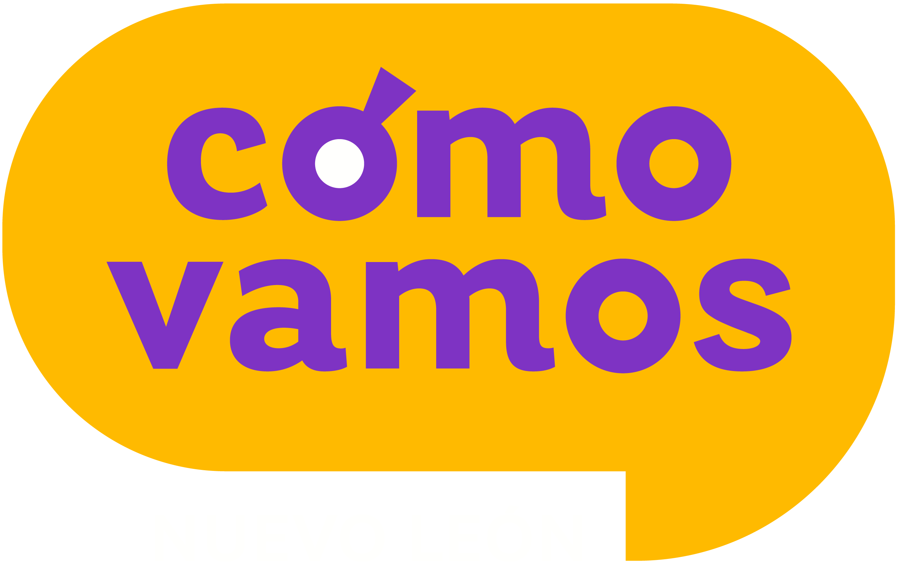

---

###  <a href="https://comovamosnl.org/" target="_blank">Cómo Vamos Nuevo León (CVNL)</a>

**Applied Research Intern**
*Jul. 2025 – Mar. 2026 · Monterrey, Mexico*

* Developed public policy recommendations addressing the measurement of domestic violence and strategies to increase youth political participation.
* Analyzed structured and geospatial data in R from internal and open sources to develop metrics used to evaluate municipal and state authorities.
* Designed and implemented a qualitative focus group research project to develop organizational growth strategies.

[Así Vamos 2025 Survey](https://comovamosnl.org/wp-content/uploads/2026/02/EncuestaCVNL-2025-31-marzo.pdf)

---

###  <a href="https://www.riskop.com.mx/" target="_blank">Riskop</a>

**Data Science Consulting Intern**
*Aug. 2024 – Mar. 2025 · Monterrey, Mexico*

* Developed data extraction, selection, and analysis projects in R and Python using advanced statistical techniques, including Principal Component Analysis (PCA) and Z-scores, for social consulting projects.
* Supported social monitoring projects using text mining, web scraping, sentiment analysis, and natural language processing techniques.

---

### Federal Deputy Campaign Team

**Data and Policy Analyst**
*Nov. 2023 – Jun. 2024 · Monterrey, Mexico*

* Developed public policy recommendations on the allocation of federal funds and strategies addressing abandoned housing for the municipality of Juárez, Nuevo León.
* Developed an R Shiny application to simulate the state-level distribution of the General Participation Fund under different weighting schemes.
* Built econometric and machine learning models to analyze and forecast electoral trends.

[FGP Simulation Application](https://emilianomontalvo.shinyapps.io/Simulador_FGP_2023/)

---

###  <a href="https://sites.google.com/view/omicrondeltaepsilon/home?authuser=0" target="_blank">Omicron Delta Epsilon México Beta Chapter (International Economics Honor Society)</a>

**President**
*Nov. 2024 – Dec. 2025 · Monterrey, Mexico*

* Coordinated academic events and stakeholder engagement with researchers, policymakers, government officials,
  industry leaders, former mayors, and representatives from international organizations including OXFAM, Fairtrade
  International, El Colegio de México, and the School of Government and Public Transformation of Tecnológico
  de Monterrey.

[ODE México Beta Chapter LinkedIn Page](https://www.linkedin.com/company/omicron-delta-epsilon-mexico-beta-chapter/)
