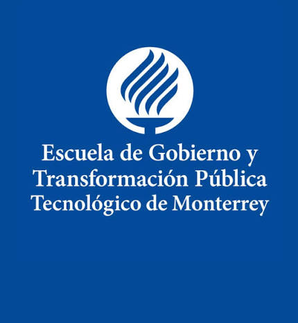

My research experience spans economics, political science, public policy, and applied data science, with a focus on quantitative research, econometrics, and reproducible data workflows.

---

###  <a href="https://www.subnationalpolitics.com/" target="_blank">Subnational Politics Project — Tecnológico de Monterrey</a>

**Student Researcher**  
*Mar. 2026 – Aug. 2026*

**Supervisors:** Dr. Agustina Giraudy; Dr. Francisco Urdinez; MPP(c) Felipe I. Soto Jorquera

Built **PROSPER**, a historical subnational dataset covering GDP, population, and GDP per capita for 83 second-tier administrative units across Argentina, Brazil, and Mexico from 1980 to 2024. Developed data harmonization, interpolation, and spatial processing procedures to construct comparable longitudinal indicators across countries and administrative boundaries. Documented data construction procedures and research design in a forthcoming codebook and working paper.

**Methods:** Data Harmonization · Interpolation · Economic Reconstruction · Spatial Data Processing · Longitudinal Data Construction

**Tools:** R · Data Engineering · Geospatial Analysis

**Selected Output:** [PROSPER Dashboard →](https://emilianomontalvo.shinyapps.io/subnational_gdp_pop/)

---

###  Department of Economics — Tecnológico de Monterrey

**Student Researcher & Project Manager**  
*Jul. 2025 – Aug. 2026*

**Supervisors:** Dr. David Valenzuela Vega; Dr. Carlos Saldaña Villanueva

Conduct research on U.S.–China trade flows using econometric and machine learning methods for forecasting and empirical analysis. Lead a multidisciplinary student research team and develop reproducible statistical programming workflows in R and Python. The project has resulted in a published manuscript and presentations at national and international academic conferences.

**Methods:** Econometric Modeling · Machine Learning · Time-Series Forecasting

**Tools:** R · Python · LSTM · Econometrics · Data Visualization

**Selected Output:** [Peer-reviewed paper →](https://doi.org/10.29105/trendinomics.v2i2.19)

---

###  Department of Political Science — Tecnológico de Monterrey

**Student Researcher**  
*Sep. 2024 – Jul. 2025*

**Supervisors:** Dr. Juan Carlos Montero Bagatella; Dr. Carlos Saldaña Villanueva

Conducted empirical research on the relationship between presidential political communication and public opinion in Mexico. Applied natural language processing and text analysis to presidential communications and combined these data with time-series regression models to examine changes in presidential approval. The research resulted in a peer-reviewed article in the *Revista Mexicana de Opinión Pública*.

**Methods:** Natural Language Processing · Text Analysis · Time-Series Regression · Political Communication Analysis

**Tools:** R · Text Mining · Econometrics

**Selected Output:** [Peer-reviewed paper →](https://revistas.unam.mx/index.php/rmop/article/view/91503)

---

###  School of Government and Public Transformation — Tecnológico de Monterrey

**Research Assistant**  
*Apr. 2025 – Sep. 2025*

**Supervisor:** Dr. Ernesto Stein

Conducted quantitative analysis of trade, investment, and employment data for an applied research project examining the economic implications of nearshoring. Developed reproducible data-processing and analytical workflows in R and Quarto and contributed to the preparation of research outputs.

**Methods:** Quantitative Analysis · Data Cleaning · Descriptive Statistics

**Tools:** R · Quarto · Data Analysis

---

###  Department of International Relations — Tecnológico de Monterrey

**Project Manager & Research Assistant**  
*Jan. 2025 – Feb. 2025*

**Supervisor:** Dr. Veronica Parra Obando

Led student research teams in an applied study of youth employment in Nuevo León and its relationship with digital transformation. Built the project's data infrastructure and statistical programming workflows and developed indicators used to examine youth employment patterns. The project resulted in an interactive dashboard presenting youth employment indicators.

**Methods:** Applied Research · Statistical Analysis · Data Visualization

**Tools:** R · Power BI · Data Analysis

**Selected Output:** [Youth Employment Dashboard →](https://app.powerbi.com/view?r=eyJrIjoiZDQ4ZmI1ZTEtMDhlZC00NWUwLTkzMzgtMjFmZWI0ZTgxZTk4IiwidCI6ImM2NWEzZWE2LTBmN2MtNDAwYi04OTM0LTVhNmRjMTcwNTY0NSIsImMiOjR9)